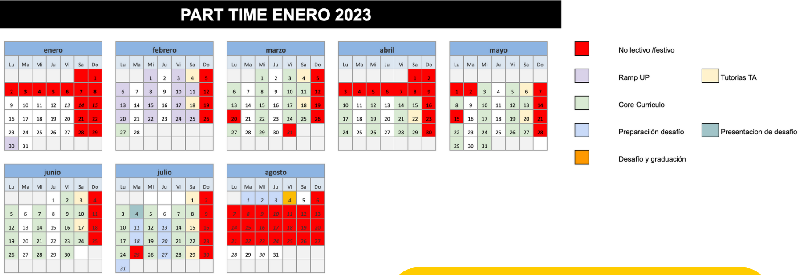

# Data Science core @ The Bridge School

This is the official repo of the The Bridge Data Science part time bootcamp from January 2023 to August 2023
> Part time edition

Forked from: https://github.com/MNievas12/core_DS_TheBridge  
and adapted to the Part time edition.

Schedule
--------------------------

Structure of the course:
------------------------  

### RAMP UP
3 weeks 

* MON 2023/01/30 - Presentation and learning Git
* WED 2023/02/01 - Markdown and Introduction to programming
* FRI 2023/02/03 - Python basics I and Python basics II
* SAT 2023/02/04 - Questions with the TAs about Git, Markdown and Python basics
* MON 2023/02/06 - More Python basics II
* WED 2023/02/08 - Flow controls
* FRI 2023/02/10 - Flow controls and exercises Python basics 
* SAT 2023/02/11 - Exercises Flow controls
* MON 2023/02/13 - Collections
* WED 2023/02/15 - Functions I
* FRI 2023/02/17 - Exercises Collections and Functions I
* SAT 2023/02/18 - Questions with the TAs about Flow controls, Collections and Functions
* MON 2023/02/20 - Functions II
* WED 2023/02/22 - More Functions II
* FRI 2023/02/24 - Object Oriented Programming (OOP)
* SAT 2023/02/25 - Python utils and final exercise

### DATA ANALYSIS
X weeks

### MACHINE LEARNING
X weeks 

### BUSINESS & PRODUCTION
X weeks 
